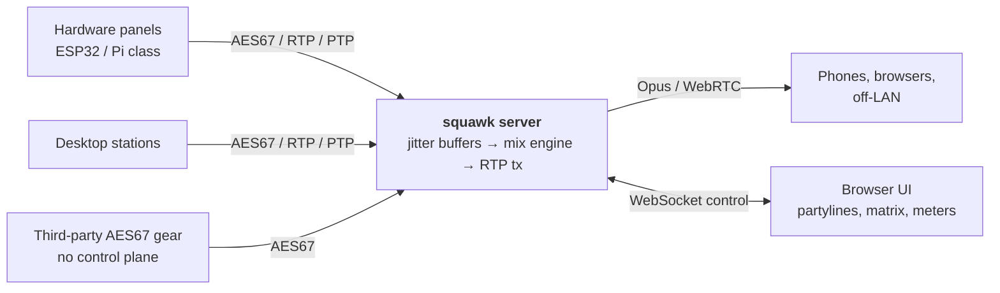

# Architecture

How squawk is put together, and — more usefully — which parts of it are not free
choices.

## Topology

A star. One server holds every bus and does every mix; endpoints only ever talk to the
server. There is no peer-to-peer path and no distributed bus.

That is not the only way to build an intercom — Green-Go pushes a shared multicast bus
to every device and lets each one mix locally, which needs no server at all. The star
costs a box, and buys three things worth more than the box: mix-minus that is exact
rather than best-effort, one place to enforce policy and record state, and a boundary
where the AES67 domain can meet a transport that phones can actually use.



## Signal path

Per endpoint, per 1 ms block:

```
mic ─▶ input gain ─▶ hard mute ─┬─▶ talk ramp ─▶ bus trim ─▶ contribution[key]
                                │                                │
                                │                                ├─▶ Σ ─▶ bus[p]
                                │                                │
                                └────────────────────────────────┴─▶ bus[p] − contribution[key]
                                                                         │
                                                                         ▼
                                                          listen gain ─▶ limiter ─▶ stream
```

The three stages in `squawk-engine` map exactly onto this: `stage_contributions`,
`stage_buses`, `stage_outputs`.

**Why the contribution buffer is kept rather than recomputed.** Mix-minus subtracts the
buffer that was added, byte for byte. Recomputing it at subtraction time — same
arithmetic, different order — would leave float residue, and reapplying a trim or a ramp
that had moved would leave much worse than residue. Keeping it is `n_streams × 48`
floats; at 320 streams that is 60 KB, which fits in L2 and costs nothing.

## Clock domains — the part that actually matters

Everything upstream of `Engine::process` lives in a **different clock domain** from the
server. Every endpoint's sound card free-runs on its own crystal, and 48 kHz on a
beltpack is not 48 kHz on the server, no matter what both of them believe.

Mix-minus is exact **only** because it subtracts the same samples that were added, in
the same block. That property is created by the jitter buffer, not by the engine. So:

- Every input must be resampled and aligned into the server's PTP-derived clock before
  it reaches the engine.
- An engine fed unaligned inputs does not fail loudly. It leaks the talker back into
  their own ear at a level that drifts with the clock offset — which sounds like a
  vague echo nobody can reproduce.

The server should be PTP-capable in both directions: grandmaster when it is the only
AES67 device that cares, slave when there is a house clock. AES67 profiles PTPv2
(IEEE 1588-2008); SMPTE 2059-2 is the profile most video-adjacent houses will be
running.

## Transport split

| Endpoint kind | Transport | Streams |
|---|---|---|
| `desktop`, `hardware`, `aes67-external` | AES67: L24 RTP, 1 ms, PTP | One per key, up to 10 |
| `mobile`, `browser` | Opus over WebRTC | One folded stereo mix |

The split is forced, not preferred. A phone has no PTP, and wifi multicast is
transmitted at the basic rate with no retransmission — AES67 over wifi does not degrade,
it disintegrates. Trying to put a phone on the AES67 leg is a dead end; don't.

**The engine is unaware of any of this.** It emits one stream per key, always. The
fold-down for Opus endpoints happens downstream by summing that endpoint's streams with
its key levels and placement applied. One mixer, one set of tests, two consumers.

## Latency budget

Rough mouth-to-ear, wired AES67 leg:

| Stage | Budget |
|---|---|
| Client capture buffer | 1–5 ms |
| Client → server, GigE LAN | < 0.5 ms |
| Server jitter buffer | 2–4 ms (the tunable one) |
| Mix engine | 1 ms (one block) |
| Server → client | < 0.5 ms |
| Client playout buffer | 1–5 ms |
| **Total** | **≈ 6–16 ms** |

That is competitive with the commercial systems. The Opus leg is a different animal:
Opus framing plus a WebRTC jitter buffer realistically lands at **40–80 ms**, and no
amount of tuning brings it near the wired leg.

**This asymmetry is a product decision, not just a number.** It is fine for a producer,
a director, or anyone listening and occasionally speaking. It is not fine for a
followspot operator taking a visual cue, or anyone whose timing depends on hearing the
call at the same instant as the person next to them. Put those on the wired leg.

## Scaling

Measured, release build, M-series Mac — 32 endpoints × 10 keys, every key talking:

```
1.000 s of audio mixed in 34.4 ms   (29x realtime, 3.4% of one core)
```

Mixing is not the constraint and will not become one. The constraint is **packet rate**:

| | 320 streams @ 1 ms |
|---|---|
| Outbound packets/sec | 320,000 |
| Payload per packet | 144 B (48 samples × L24) |
| On-wire per packet | ~202 B |
| Aggregate | ~520 Mbit/s |

520 Mbit/s is comfortable on GigE. 320k syscalls per second is not. The transport must
batch every stream for a given tick into one `sendmmsg` from its first commit — this is
an architectural constraint, not an optimisation to reach for later.

Two levers exist if a system gets bigger than one server can serve: raise the packet
time to 2–4 ms (fewer, larger packets, at a direct cost in latency), or shard endpoints
across servers with a bus trunk between them. Neither is designed yet.

## What is deliberately not decided

- **Call/alert signalling** — the flashing-light "answer me" path. Control plane, not
  audio; needs designing alongside the WebSocket protocol.
- **Groups / IFB** — talk to many with no return mix. The `KeyTarget` enum has room.
- **Stereo key placement** — putting keys across the ears. Belongs in the client for the
  AES67 leg (it has the streams separately) and in the server for the Opus fold.
- **Sidetone** — hearing yourself. Belongs in the client, near the mic, so it doesn't
  inherit network latency.
- **Recording and logging** — the server sees every bus already.
