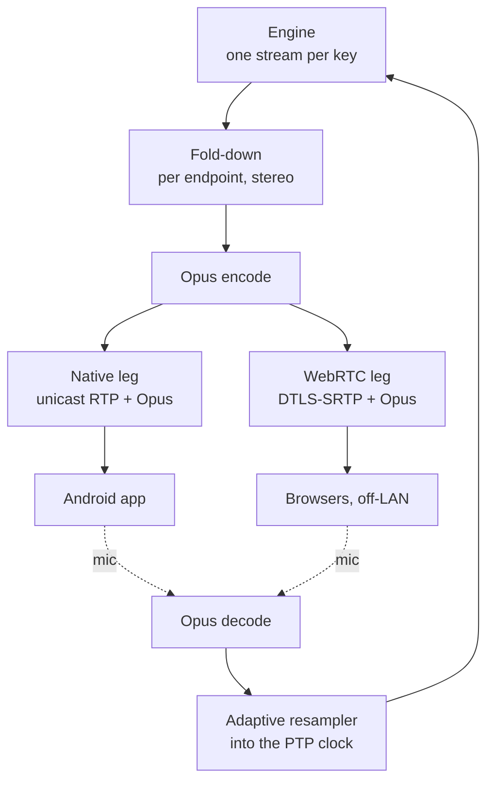

# The mobile leg

Android beltpacks over wifi: what has to be built, and which parts of it are not free
choices.

This document covers the transport, processing and control paths for `EndpointKind`
`Mobile` and `Browser`. The seams already exist — `uses_aes67()` excludes both kinds,
and `AudioIo` already holds `None` for every Opus-leg endpoint — so nothing here is a
retrofit. It is the leg [ARCHITECTURE.md](ARCHITECTURE.md) always described and never
built.

## Shape

Two transports, one processing layer. The split is at the transport boundary and
nowhere else.



Everything from Opus inward is shared: one codec path, one resampler, one fold-down,
one set of tests. **If the two legs ever diverge above the transport, that is a bug**,
not a feature — the whole reason to build them together is that the expensive parts are
common and the transports are thin.

## Why two transports rather than WebRTC alone

ARCHITECTURE.md says "Opus over WebRTC" for mobile. That was written with browsers in
mind, and for a browser it is the only option. For a **native app we own both ends of**,
WebRTC's handshake buys nothing: ICE exists to traverse NATs that are not there on a
show LAN, and DTLS-SRTP protects a path we already control.

So the native leg is plain unicast RTP carrying Opus, with squawk's own jitter buffer —
the one in `squawk-rtp` that already works. It drops a large dependency from the client,
removes SDP and ICE from the bring-up path, and lands roughly **half the latency**,
because we choose the frame size and the buffer target rather than inheriting them.

WebRTC stays, for browsers and for anything off-LAN. It is the second consumer of the
same fold-down and the same resampler.

## The fold-down

The engine emits one stream per key, always, and knows nothing about transports. For an
AES67 endpoint those streams go out separately, which is what lets a panel change its
own key levels instantly and locally. A mobile endpoint gets them summed:

```
for each key on the endpoint:
    stream[key]                             (already bus-minus-own, listen gain, limited)
      × live_level[key] × !live_mute[key]
      × placement[key]                      (L / R / both)
  ─────────────────────────────────────
  Σ  ─▶ per-endpoint limiter ─▶ Opus
```

⚠️ **The fold needs its own limiter, and it goes after the sum.** On the AES67 leg the
limiter is per stream, before anything is combined — see the mix-minus reasoning in
ARCHITECTURE.md. Here, ten already-limited streams summed together can exceed full scale
comfortably. The two legs limit at different points *on purpose*. Do not "fix" the
asymmetry.

⚠️ **Live key levels are applied in different places on the two legs, and this is
visible to the user.** An AES67 panel adjusts its own key level with no round trip,
because it holds the streams separately. A mobile endpoint cannot — the sum happened on
the server, so its level change is a control message and a round trip. That is inherent
in folding, not a shortcoming of the implementation. The protocol must carry per-key
level and mute for exactly this reason, and the app should move its own fader
immediately and let the audio follow.

## The clock, which is where this leg will actually go wrong

Every phone's microphone clock free-runs. A typical crystal is 20–50 ppm out, which at
48 kHz is **one to two and a half samples every second** — and unlike a squawk hardware
panel, a phone has no PTP and cannot be disciplined into our domain.

That matters more here than it would in a simpler mixer, because of the property the
whole design rests on:

> Mix-minus is exact **only** because it subtracts the same samples that were added, in
> the same block. That property is created by the jitter buffer, not the engine.

An engine fed unaligned input does not fail loudly. **It leaks the talker back into
their own ear at a level that drifts with the clock offset** — a vague echo nobody can
reproduce, on one endpoint, changing over minutes. This is the single most likely
serious bug in the whole leg.

So ingress is not a jitter buffer, it is a **jitter buffer plus an adaptive
resampler**: measure buffer depth, servo the resample ratio to hold it at target,
resample into the server's PTP-derived clock before the engine ever sees it.

Three lessons transfer directly from `squawk-ptp`, and all three were learned the hard
way there:

- **Servo on the corrected value, not the raw one.** The PTP servo measured on
  `local_now` instead of `ptp_now` and its input therefore never responded to its
  output: same offset for ever, stepping repeatedly, never locking. A resampler servo
  reading pre-correction depth has the identical failure.
- **Lock needs hysteresis** — credit 1, debit 4, as PTP uses. One outlier packet must
  not drop lock and flap everything gating on it.
- **Do not run the servo on the audio thread.** Polling at block rate quantises the
  measurement into the thing being measured.

Egress has the mirror problem — the phone's *playout* clock drifts against our send
rate. WebRTC absorbs this in NetEq. **The native leg must do it in the app**, in the
shared Rust client core, with the same servo.

## Latency

Mouth to ear, mobile leg, both transports:

| Stage | Native RTP | WebRTC |
|---|---|---|
| Capture buffer (AAudio low-latency) | 10 ms | 10 ms |
| Opus frame | 10 ms | 20 ms (default) |
| Encode + network, 5 GHz, PSM off | 3–10 ms | 3–10 ms |
| Server jitter buffer + resampler | 15–25 ms | — |
| WebRTC receive buffer (NetEq) | — | 40–60 ms |
| Mix engine | 1 ms | 1 ms |
| Fold + encode | 10 ms | 20 ms |
| Return network + client buffer | 10–20 ms | 15–30 ms |
| **Total** | **≈ 25–40 ms** | **≈ 40–80 ms** |

Use Opus at **10 ms frames in restricted-lowdelay mode** on the native leg — the default
20 ms framing plus LPC lookahead is most of the difference above.

**The mean is not the problem; wifi variance is.** A congested 2.4 GHz band, a roaming
event, or an AP doing band steering will blow any of these numbers on a single packet
and the buffer has to absorb it. Which leads to the one deployment rule that matters
more than any tuning below it:

⚠️ **If the show wifi is not yours, this is not a reliable product.** Dedicated 5 GHz
SSID, power save off, no band steering, DTIM tuned, APs placed for the beltpacks and not
for the audience's phones. Say so in the user guide, in those words.

### Positioning, restated

Even at 25–40 ms these are beltpacks for people who **listen and occasionally speak** —
producers, directors, stage management. Not for a followspot operator taking a visual
cue, or anyone whose timing depends on hearing the call at the same instant as the
person beside them. ARCHITECTURE.md already made that call for the Opus leg; a faster
native transport narrows the gap and does not close it. Put timing-critical positions on
the wired leg.

## The client protocol

The existing HTTP API is **operator**-shaped: whole-config mutations, every response the
entire state, and `/ws` a one-way meter push. That is right for a config UI and wrong
for a panel. Beltpacks get their own endpoint-facing protocol on a separate WebSocket.

| Direction | Message | Meaning |
|---|---|---|
| → server | `hello { token }` | Identify. Token binds to exactly one endpoint id. |
| ← client | `layout { keys[], labels, targets, talk_modes }` | Full key layout. Re-sent on any config change. |
| → server | `talk { slot, on }` | Talk intent. Server is authoritative. |
| → server | `key-level { slot, db }` / `key-mute { slot, on }` | Fold parameters — mobile only. |
| → server | `call { slot }` | Attention signal to that key's target. |
| ← client | `call-alert { from, target }` | Someone is calling this endpoint or its partyline. |
| ← client | `state { talking[], meters[], call_active[] }` | 10–20 Hz. |

⚠️ **Losing the connection must clear that endpoint's talk state, server-side.** A phone
that walks out of coverage with a latched key leaves an open microphone on a live
partyline that nobody can see or close. Talk intent already lives in the host keyed by
`(endpoint, slot)` and survives config rebuilds — it must **not** survive a client
disconnect. On reconnect the client re-`hello`s and talk starts off, always.

**Authentication does not currently exist anywhere in squawk.** That is defensible for a
config UI on a trusted box and indefensible for an endpoint protocol: without it, anyone
on the venue wifi can key up the director's channel. Per-endpoint bearer token, issued
by the server, delivered by QR at provisioning time along with the server address and
endpoint id.

### Call signalling

ARCHITECTURE.md lists this under "deliberately not decided". Deciding it here, because a
beltpack without a call light is missing a feature every commercial panel has:

`call { slot }` raises a flag on that key's target for a few seconds; the server
broadcasts `call-alert` to every endpoint on that target. It lives **entirely in the
control plane**, so it costs no audio bandwidth and works identically on the AES67 leg,
where the panel has no other way to be told.

### Sidetone

Client-side, generated at the microphone, never round-tripped. On any leg. If sidetone
comes back over the network it inherits the network's latency and stops being sidetone.

## The Android client

**Audio.** AAudio, low-latency/exclusive mode, 48 kHz, mono capture and stereo playout.
Capture with the `UNPROCESSED` or `MIC` source and do gain in our own code — the
`VOICE_COMMUNICATION` preset switches on the OEM's AGC, noise suppression and echo
canceller, which are tuned for telephony and will pump, gate and duck a comms feed in
ways that look like squawk misbehaving.

**Core in Rust, shell in Kotlin.** The workspace is already Rust and already contains
the jitter buffer, the RTP packetiser, the resampler servo and the protocol types. A
`squawk-client` crate cross-compiled for Android over JNI reuses all of it and keeps one
implementation under test. Compose does the keys grid, faders, call lights and meters —
and nothing else.

**Headsets: wired only.** Bluetooth forces HFP, which is 16 kHz mSBC at 100–150 ms and
takes over the microphone as well. It will sound terrible and it will be blamed on
squawk. Detect SCO and warn loudly rather than letting it happen quietly.

**PTT** is volume-key capture on a stock device, and a real programmable key on the
image.

## The device image

Chosen deliberately over Device Owner / COSU kiosk provisioning, which reaches much of
the same ground with no OS build. What the image adds beyond what COSU can do:

- Pin the AAudio fast path and **strip OEM audio effects out of the HAL config**, rather
  than asking for `UNPROCESSED` and hoping.
- **Wifi power save off** at the driver, and control over roaming and band behaviour.
- Boot straight into the beltpack. No telephony, no notifications, no other apps to take
  audio focus mid-show.
- A real PTT button mapping.
- An OTA channel we own, so forty devices are on one version.

What the image does **not** buy, and should not be expected to:

- **It does not make AES67 possible.** Wifi multicast is still sent at the basic rate
  with no retries and the hardware still has no PTP. The reason this leg is Opus is
  physical, not a limitation of stock Android.
- **It does not move the latency floor much.** Codec framing and the jitter buffer
  dominate the table above. The image tightens the tail, not the mean.

**Pick one reference device and treat porting cost as the main risk.** Per-device
bring-up is what kills image projects. Selection criteria: known-good AAudio low-latency
support, 5 GHz wifi, wired audio (USB-C or jack), unlockable bootloader, available in
quantity for several years. Rugged Android PTT handsets already exist as a product
category for push-to-talk-over-cellular, and one of those is a better starting point
than a consumer phone — programmable PTT key, wired headset, and a case that survives a
crew.

**Build order within this workstream:** the app must be proven on stock hardware first.
Not because the image is optional — it is in scope — but because a beltpack that
misbehaves on an unproven image gives no way to tell an app bug from an image bug.

## What is deliberately not decided

- **Off-LAN and TURN.** The WebRTC leg makes it possible; nothing here designs the
  relay, the credentials or who pays for the bandwidth.
- **Groups and IFB on mobile.** `KeyTarget` has room; the fold has to learn what a
  no-return key means.
- **Stereo placement UI.** The fold applies placement; nothing decides how a user sets
  it, or whether they can.
- **Recording the mobile leg** separately from the buses the server already sees.
- **More than one server.** Sharding endpoints across servers with a bus trunk is
  undesigned on the AES67 leg too.

## Risks, ranked

1. **The resampler leaks the talker into their own ear.** Silent, drifting, per-endpoint,
   and it presents as "the app is a bit echoey". Test it the way the engine is tested —
   a ramp whose sample values encode their own index, pushed through a deliberately
   offset clock, asserting the talker's own feed stays at the floor for minutes, not
   blocks.
2. **Show wifi that isn't ours.** No amount of buffer tuning survives it, and it will be
   the most common field failure by a wide margin.
3. **Per-device Android audio variance.** The reason to standardise on one reference
   device early.
4. **Users pairing Bluetooth headsets.** It will happen. Refuse it visibly.
5. **Image bring-up cost** against a device that goes end-of-life.
